# Simple Docker

## Contents

1. [Готовый докер](#1-готовый-докер)
2. [Операции с контейнером](#2-операции-с-контейнером)
3. [Мини веб-сервер](#3-мини-веб-сервер)
4. [Свой докер](#4-свой-докер)
5. [Dockle](#5-dockle)
6. [Basic Docker Compose](#6-базовый-docker-compose)

## 1. **Готовый докер**

`$sudo snap install docker` - установить докер

`$docker info` - информация о докере и контейнерах на текущий момент

1. Взять официальный докер образ с nginx и выкачать его при помощи `docker pull nginx`


2. Проверить наличие докер образа через `docker images`

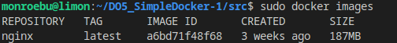

3. Запустить докер образ через `docker run -d [image_id|repository]`

4. Проверить, что образ запустился через `docker ps`

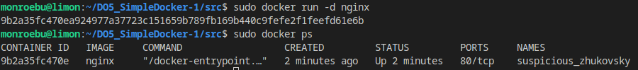

5. Посмотреть информацию о контейнере через `docker inspect [container_id|container_name]`

По выводу команды определить и поместить в отчёт размер контейнера, список замапленных портов и ip контейнера.

Прим.  слово **"замапленный"** (mapped) в контексте Docker относится к процессу привязки (отображения) портов и ресурсов одной системы (например, контейнера) к портам и ресурсам другой системы (например, хоста или сети). Это делается для обеспечения доступа извне к сервисам, развернутым в контейнере, через определенные порты на хосте.

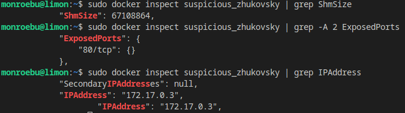

6. Остановить докер образ через `docker stop [container_id|container_name]`

`docker ps`  - показывает весь список доступных контейнеров

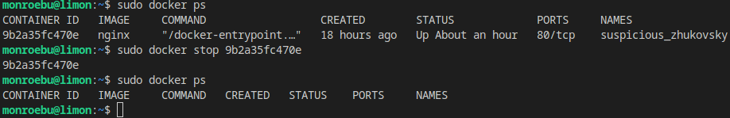


7. Запустить докер с портами 80 и 443 в контейнере, замапленными на такие же порты на локальной машине, через команду *run*

`sudo docker run -d -p 80:80 -p 443:443 nginx`

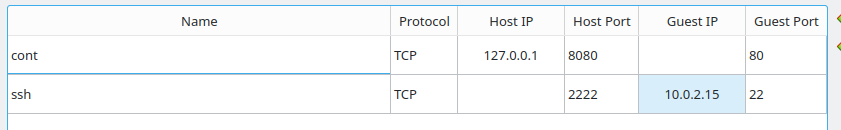

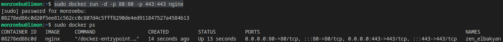


8. Проверить, что в браузере по адресу *localhost:80* доступна стартовая страница **nginx**

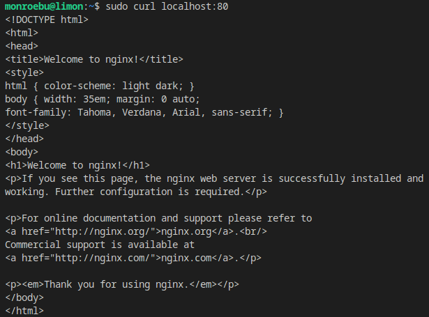

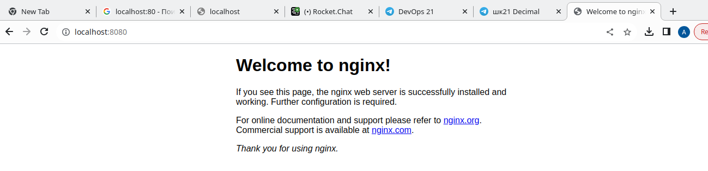

9. Перезапустить докер контейнер через `docker restart [container_id|container_name]`

Проверить любым способом, что контейнер запустился.

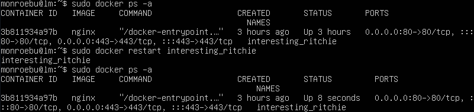


## 2. **Операции с контейнером**

1. Прочитать конфигурационный файл *nginx.conf* внутри докер контейнера через команду *exec*

`docker exec -it имя cat /etc/nginx/nginx.conf`

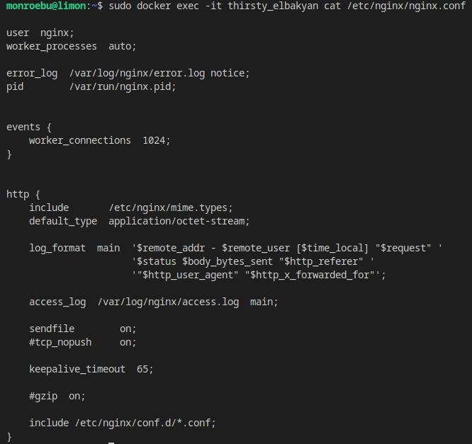

2. Создать на локальной машине файл *nginx.conf*

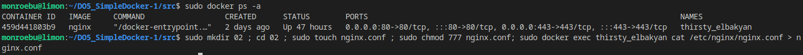

3. Настроить в нем по пути */status* отдачу страницы статуса сервера **nginx**

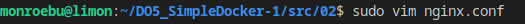
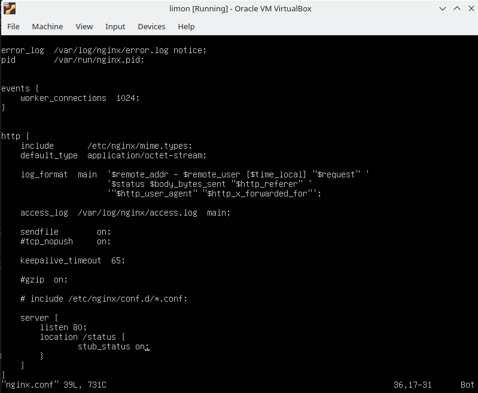

4. Скопировать созданный файл *nginx.conf* внутрь докер образа через команду `sudo docker cp nginx.conf имя контейнера:/etc/nginx/`
sudo docker cp nginx.conf interesting_ritchie:/etc/nginx/


5. Перезапустить **nginx** внутри докер образа через команду `sudo docker exec interesting_ritchie nginx -s reload`

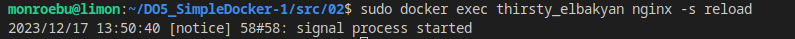

* **Флаг -s** перезаписывает файлы конфигурации и логи, если они были изменены после последнего перезапуска сервера.

* Откроем доступ в директорию `sudo docker exec hopeful_mendeleev chmod 777 ./var/log/nginx`.

* Назначим пользователя monroebu на директорию /var/log/nginx со всеми файлами в нем `sudo docker exec hopeful_mendeleev chown monroebu:monroebu 777 ./var/log/nginx`. Без ключа -R соответственно изменения будут только применены на директорию.

6. Проверить, что по адресу *localhost:80/status* отдается страничка со статусом сервера **nginx**

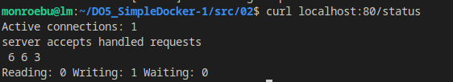

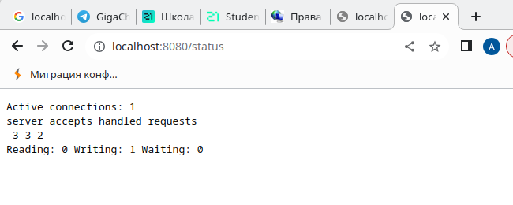

7. сЭкспортировать контейнер в файл *container.tar* через команду `sudo docker export interesting_ritchie > ./container.tar`
8. Остановить контейнер


9. Удалить образ через `docker rmi [image_id|repository] -f`, не удаляя перед этим контейнеры

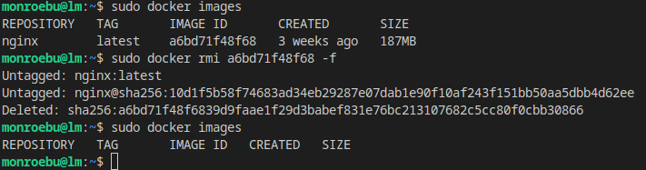

10. Удалить остановленный контейнер

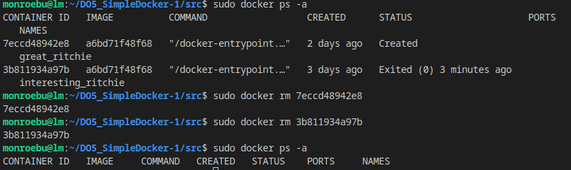

11. Импортировать контейнер обратно через команду  `docker import -c 'cmd ["nginx", "-g", "daemon off;"]' -c 'ENTRYPOINT ["/docker-entrypoint.sh"]' ./container.tar nginx_new`.

* `Опция -c` указывает на то, что нужно выполнить команды docker-entrypoint.sh и ENTRYPOINT.

* с `флагом -g` Docker загружает и запускает контейнер из файла, а без этого флага Docker просто загружает файл в контейнер.

* `daemon off` - это команда, которая отключает дескриптор докера (запуск контейнера в фоновом режиме)

Запустить импортированный контейнер.
Проверить, что по адресу *localhost:80/status* отдается страничка со статусом сервера **nginx**.

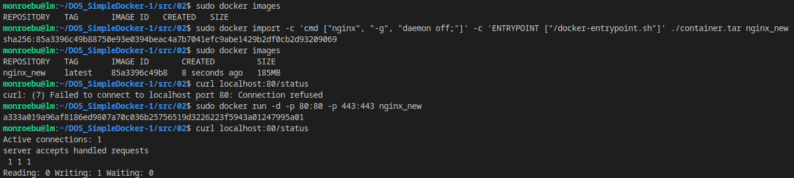

## 3. Мини веб-сервер

1. Написать мини сервер на **C** и **FastCgi**, который будет возвращать простейшую страничку с надписью `Hello World!`. 
**FastCGI** — это протокол, который позволяет веб-серверу и веб-приложению общаться друг с другом. 

* Установить в виртуалку `sudo apt install gcc`.

* Установить библиотеку libfcgi-dev, выполнив команду `sudo apt-get install libfcgi-dev nginx`.

* Программа на C:

Используя API, предоставленный <fcgiapp.h> заголовок, можно указать сведения о сокете, что делает за вас создание с помощью внешних средств.
Дескриптор файла сокета TCP можно получить следующим образом:

* `int sockfd = FCGX_OpenSocket("127.0.0.1:9000", 100);`
...или используя сокеты Unix:
* `int sockfd = FCGX_OpenSocket("/var/run/fcgi.sock", 100);`

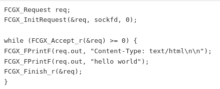

После компиляции двоичный файл можно выполнить напрямую, без использования spawn-fcgi или cgi-fcgi .

* Скомпилировать server.c, выполнив команду `gcc server.c -lfcgi -o server`

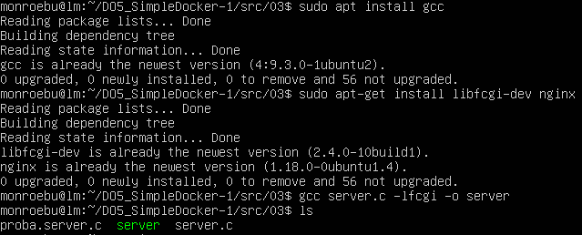

**ВАРИАНТ 1**

* отредактировать файл default 
 
 `sudo chmod +w /etc/nginx/sites-enabled/default`

`sudo vim /etc/nginx/sites-enabled/default`

до:o
        # Add index.php to the list if you are using PHP
        index index.html index.htm index.nginx-debian.html;

        server_name _;

        location / {
                # First attempt to serve request as file, then
                # as directory, then fall back to displaying a 404.
                #try_files $uri $uri/ =404;
                fastcgi_pass 127.0.0.1:9000;
                include fastcgi_params;
        }

__________________

`sudo service nginx restart`

* запускаю программу в фоне `./server&`

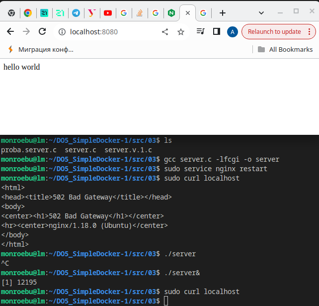

* `jobs` посмотреть что висит в фоне введи 

* после будет выведен список программ работающих в фоне 
чтобы вывести из фона нужно написать 
`fg айди_процесса`

**ВАРИАНТ 2**

2. Запустить написанный мини сервер через *spawn-fcgi* на порту 8080. **spawn-fcgi** — это утилита, используемая в веб-сервере FastCGI для запуска сервера FastCGI.

* Откатила дамп виртуальной машины до конца 2 задания.

//* Установить библиотеку spawn-fcgi, выполнив команду `sudo apt-get install spawn-fcgi`

//* Запустить мини сервер через spawn-fcgi на порту 8080: `spawn-fcgi -p 8080 ./server`

* Проверить результат `lsof -i :8080`. lsof - это утилита, которая позволяет просматривать открытые файлы и сокеты на вашей системе. Опция -i указывает lsof отобразить информацию о сетевых сокетах.

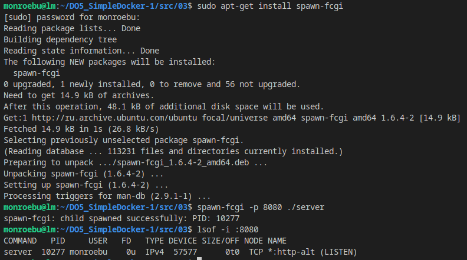

3. Написать свой *nginx.conf*, который будет проксировать все запросы с 81 порта на *127.0.0.1:8080*
    1. Загрузить nginx, выполнив команду `docker pull nginx`
    
    2. Убедиться, что порт 81 не занят, выполнив команду `lsof -i :81`

    3. Запустить докер с портом 81 в контейнере, замапленным на такой же порт на локальной машине, через команду `docker run -d -p 81:81 nginx`<br>
        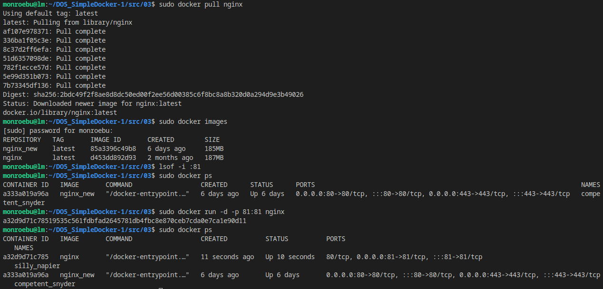<br>

    4. Создать в проекте (на локальной машине) файл nginx.conf командой `sudo touch nginx.conf ; sudo chmod 777 nginx.conf; sudo docker exec silly_napier cat /etc/nginx/nginx.conf > nginx.conf` <br>
    
    5. Настроить его на проксирование всех запросов с 81 порта на 127.0.0.1:8080<br>

        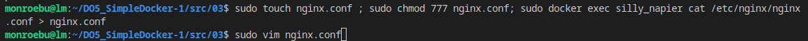<br>

        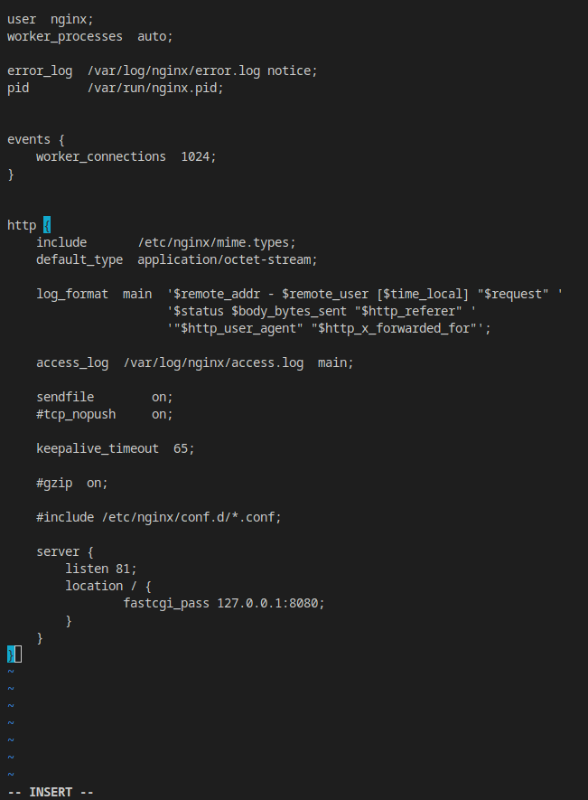<br>

    6. Скопировать созданный файл nginx.conf и server.c внутрь докер образа через команды `sudo docker cp nginx.conf silly_napier:/etc/nginx/` и `sudo docker cp ../03/server.c silly_napier:/home/`:<br>
        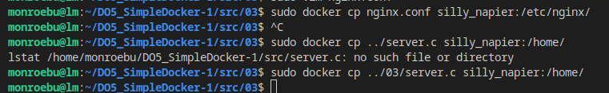<br>

    7. Связать текущий терминал с терминалом контейнера objective_margulis командой `sudo docker exec -it silly_napier bash`:<br>
        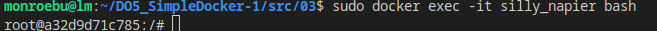<br>

    8. Обновить пакеты командой `apt update`:<br>
    
    9. Установить gcc, spawn-fcgi, libfcgi-dev командой `apt install gcc spawn-fcgi libfcgi-dev`:<br>
        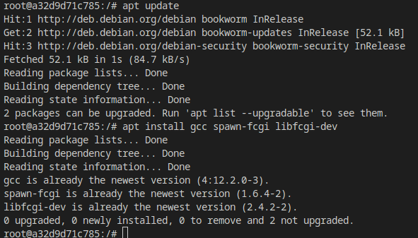<br>

    10. Скомпилировать и перезапустить:<br>
    `cd home`<br>
    `gcc -o server server.c -lfcgi`<br>
    `spawn-fcgi -p 8080 ./server`<br>
    `nginx -s reload`<br>
    Важно отметить, что выполнение команды 'nginx -s reload' внутри Docker-контейнера не приведет к перезапуску самого контейнера. Контейнер продолжит работать, даже если экземпляр nginx внутри него перезапущен.<br>

        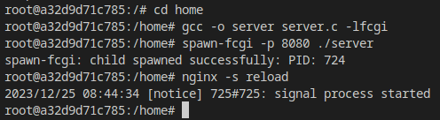<br>

* Узнаю IP адрес контейнера `sudo docker inspect silly_napier | grep IPAddress`

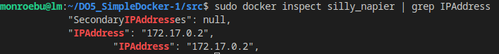<br>
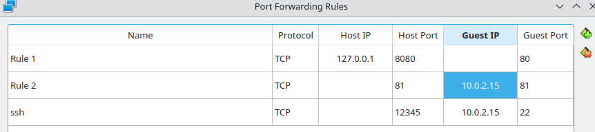<br>

4. Проверить, что в браузере по *localhost:81* отдается написанная вами страничка

`curl localhost:81`

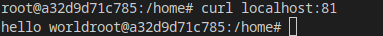<br>

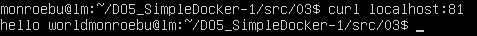<br>

* Для установки терминального браузера на Ubuntu 20.04 без графического интерфейса вы можете использовать текстовый браузер, такой как Links или Lynx. 

Для установки **Links**, выполните следующую команду в терминале:
```
sudo apt update
sudo apt install lynx
```

После установки вы сможете использовать текстовый браузер для просмотра веб-страниц и выполнения других веб-операций непосредственно из терминала.

`lynx localhost:81`

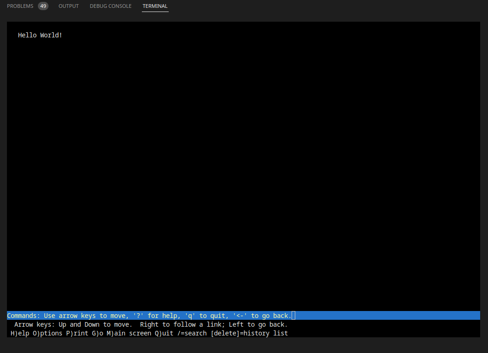<br>

* Положить файл *nginx.conf* по пути *./nginx/nginx.conf* (это понадобится позже)

* `shutdown -h now` - выключить виртуалку

## 4. Свой докер

1. Написать свой докер образ, который:
    - собирает исходники мини сервера на FastCgi из [Части 3](#part-3-мини-веб-сервер)
    - запускает его на 8080 порту
    - копирует внутрь образа написанный *./nginx/nginx.conf*
    - запускает **nginx**.

- **run.sh** компилирует файл server.c из прошлого задания и запускает его на 8080 порту (файл help_in_cont.sh с 3 задания):

- **nginx.conf** из 3 части

- **Dockerfile**, с настройками будущего образа (следует избегать множественных вызовов команд RUN):

2. Собрать написанный докер образ через build <br>
```
FROM nginx

WORKDIR /home
LABEL autor=monroebu

COPY ./nginx/nginx.conf /etc/nginx/nginx.conf
COPY ./server.c .
COPY ./run.sh .

RUN apt-get update \
    && apt-get install -y gcc spawn-fcgi libfcgi-dev \    
    && gcc -o server server.c -lfcgi
ENTRYPOINT [ "./run.sh" ]

```
<br>

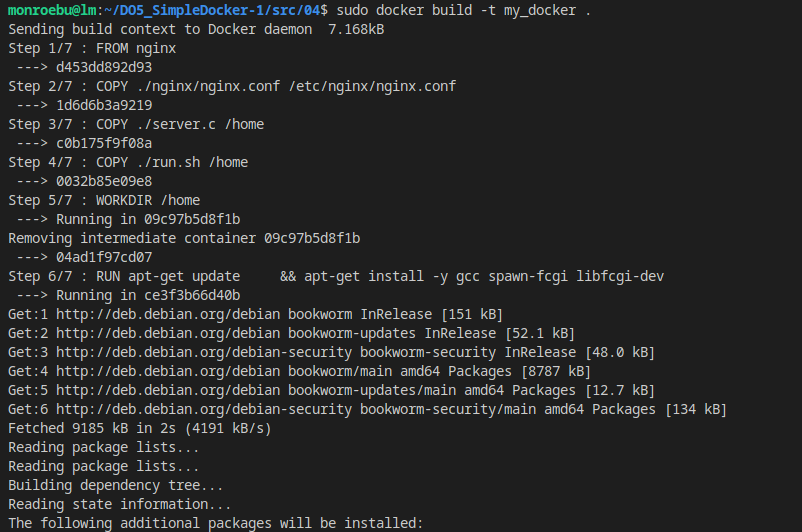

...

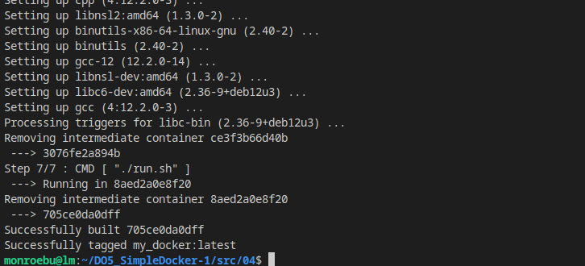
<br>

3. Проверить через `docker images`, что все собралось корректно<br>
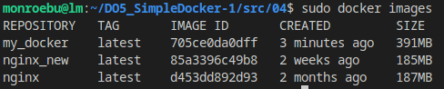<br>

* `docker system prune` - очистка остановленных контейнеров. 
    ##### **docker system prune** удаляет неиспользуемые данные в Docker, включая: 
    ##### 1. Неиспользуемые (орфанные) контейнеры
    ##### 2. Неиспользуемые образы
    ##### 3. Временные контейнеры
    ##### 4. Неиспользуемые volumes

* `docker image rm 705ce0da0dff` - удалить образ 705ce0da0dff (ID)


* Команда `nginx -g 'daemon off'` запускает веб-сервер Nginx в режиме демона с указанием, что он не должен работать в фоновом режиме. Обычно, при запуске Nginx, он работает как демон и переходит в фоновый режим после успешной инициализации. Однако с помощью опции -g 'daemon off' мы указываем Nginx не переходить в фоновый режим, а оставаться в переднем плане, что может быть полезно для отладки или работы с контейнерами в Docker, где контейнер завершается, если процесс в переднем плане завершается.


4. Запустить собранный докер образ с маппингом 81 порта на 80 на локальной машине и маппингом папки *./nginx* внутрь контейнера по адресу, где лежат конфигурационные файлы **nginx**'а (см. Часть 2)

##### Маппинг в контексте Docker означает установку соответствия между портами или директориями на хост-системе и контейнером.

##### Например, маппинг портов позволяет связать порт на хост-машине с портом внутри контейнера Docker, так что запросы, направленные на определенный порт хоста, будут перенаправлены внутрь контейнера.

##### Маппинг директорий позволяет связать директорию на хост-системе с директорией внутри контейнера. Это удобно для обмена файлами и конфигурационными файлами между хостом и контейнером.

##### Таким образом, при запуске собранного Docker-образа с маппингом порта 81 на порт 80 и директории ./nginx внутри контейнера, конфигурационные файлы nginx на хост-системе будут доступны внутри контейнера по указанному пути.

* удалила созданный образ, дописала в Dockerfile номер порта, который будет использоваться на локальном компьютере
```
EXPOSE 80
```

* `sudo docker run -p 80:81 76b3e3fb8858`
    - запускает образ ID 76b3e3fb8858, указывая какой порт будет использоваться на локальном компьютере (80) и с каким портом внутри самого контейнера мы соединяемся (81)

* `sudo docker run -d -p 80:81 --name my_container -v /home/monroebu/DO5_SimpleDocker-1/src/04/nginx/nginx.conf:/etc/nginx/nginx.conf -d my_docker`
    - -v /home/monroebu/DO5_SimpleDocker-1/src/04/nginx/nginx.conf:/etc/nginx/nginx.conf создает примонтированное тома, где файл /home/monroebu/DO5_SimpleDocker-1/src/04/nginx/nginx.conf на хосте будет доступен в контейнере по пути /etc/nginx/nginx.conf.
    - -d запускает контейнер в фоновом режиме (detached mode).

* создала файл в помощь `build.sh`:
```
#!/bin/bash

sudo docker build -t my_docker .

#sudo docker run -d -p 80:81 --name my_container my_docker

sudo docker run -d -p 80:81 --name my_container -v /home/monroebu/DO5_SimpleDocker-1/src/04/nginx/nginx.conf:/etc/nginx/nginx.conf -d my_docker

echo -e "\033[32m""\t\tmonroebu""\033[0m"
```

<br>

* убедившись, что прочие контейнеры не запущены, запустила build.sh

5. Проверить, что по localhost:80 доступна страничка написанного мини сервера

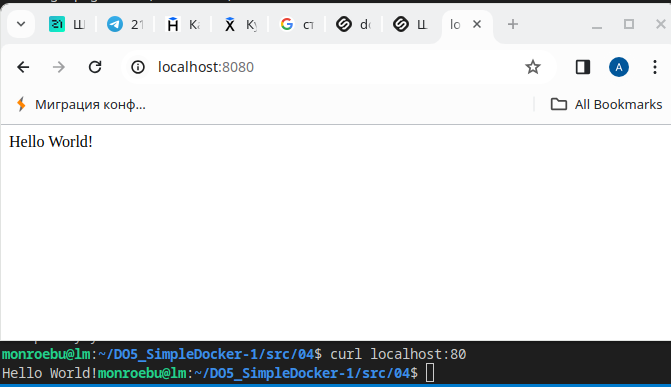<br>

6. Дописать в *./nginx/nginx.conf* проксирование странички */status*, по которой надо отдавать статус сервера **nginx**

* Дописала в nginx.conf `stub_status on`:<br>
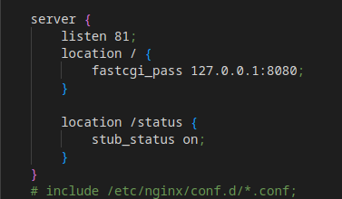<br>

7. Перезапустить докер образ
*Если всё сделано верно, то, после сохранения файла и перезапуска контейнера, конфигурационный файл внутри докер образа должен обновиться самостоятельно без лишних действий*

* `docker exec -it имя bash`

* внутри контейнера команда `nginx -s reload`

8. Проверить, что теперь по *localhost:80/status* отдается страничка со статусом **nginx**

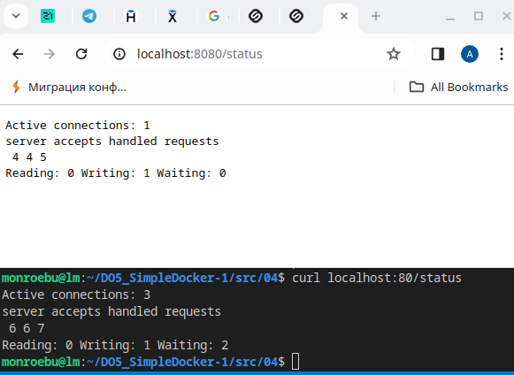<br>

**9. Полезное**

* `systemctl stop docker` - остановить службу Docker (например, для обновления конфигурационных файлов Docker-контейнера). Это действие приведет к отключению всех Docker-контейнеров до тех пор, пока процесс настройки не закончится.

* `systemctl start docker` - запуск службы докера

* `/var/lib/docker` - все конфигурационные файлы, которые относятся к Docker-контейнерам, образам, томам и сетям Docker

* `env` - посмотреть переменные окружения (environment veriables) 
 
* `docker volume ls` - посмотреть какие volumes есть (постоянные данные) 
 
* `cat <<EOT >> 1.txt` - так можно добавить текст в файл 1.txt, находясь внутри контейнера без вима 
 
* `docker volume create abcd` - создание volume abcd (см папку /var/lib/docker/volumes/ либо `var/snap/docker/common/var-lib-docker/volumes`) 
 
* `docker volume rm abcd` - удаление вольюма abcd 
 
* `docker volume ls` - посмотреть какие уже вольюмы есть

* `docker run nginx --network=host` - запуск контейнера в типе сети host (наряду с bridge, none). При создании контейнер получает IP-адрес хоста, отличаются портами.

* `docker network create --drive bridge MYNAME` - создание новой сети MYNAME. если не указывать --drive, по умолчанию тип будет bridge

* `docker network ls` - посмотреть, какие типы сетей есть в докере

* `docker run --name comtainer1111 --net MYNAME nginx /bin/bash` - запуск контейнера comtainer1111 в сети MYNAME

* `docker network connect MYNAME comtainer2` - подключение в сеть MYNAME контейнера comtainer2 из другой сети. Теперь comtainer1111 и comtainer2 будут пинговаться и по IP и по DNS. Чтобы отключиться от старой сети, из `docker inspect container2` взять `"NetworkID"` и ввести команду `docker network disconnect 0939b0064cd18360b2b9f4f1eec3b0af7dc15345da87ea86685b6528f88836fb container2` (0939b0064c... - длинный ID старой сети (NetworkID)).

* `docker tag 9dabad518d97 ggg` - если надо переименовать образ на ggg (9dabad518d97 -  IMAGE ID этого образа), например сделали когда "docker build ." без указания имени контейнера

* `curl -Li localhost:80`
    * Ключ `-i` в команде curl -Li localhost:80 отправляет запрос на указанный URL и позволяет просмотреть заголовки ответа сервера, в том числе статус ответа и другие заголовки. 
    * Ключ `-L` указывает curl следовать перенаправлениям (если они есть) и получить конечный URL.


## 5. **Dockle**

После написания образа проверить его на безопасность.

0. Установка
```
$ VERSION=$(
 curl --silent "https://api.github.com/repos/goodwithtech/dockle/releases/latest" | \
 grep '"tag_name":' | \
 sed -E 's/.*"v([^"]+)".*/\1/' \
) && curl -L -o dockle.deb https://github.com/goodwithtech/dockle/releases/download/v${VERSION}/dockle_${VERSION}_Linux-64bit.deb
$ sudo dpkg -i dockle.deb && rm dockle.deb
```

1. Просканировать образ из предыдущего задания через `dockle [image_id|repository]`

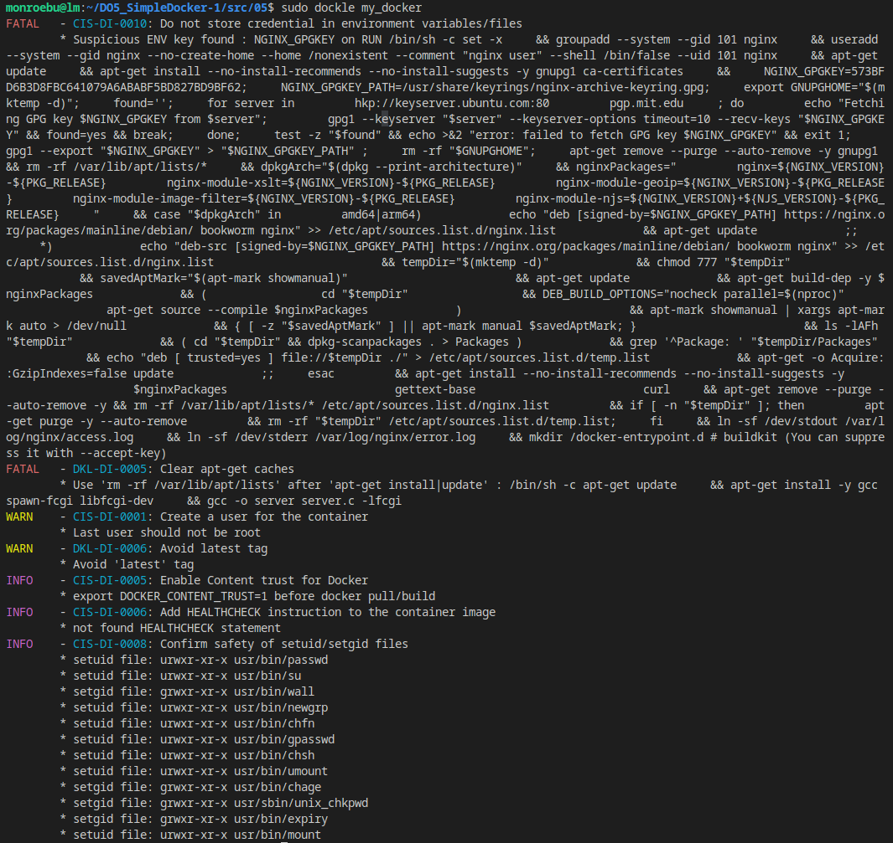<br>

Под термином `Healthcheck` следует понимать способ проверки рабочего состояния ресурса. Он определяет состояние запущенного в Docker контейнера.

Создаваемая команда Healthcheck определяет возможность тестирования контейнера, чтобы убедиться в его работоспособности. Docker без Healthcheck не сможет определить, действительно ли запущены работающие в контейнере службы.

2. Исправить образ так, чтобы при проверке через **dockle** не было ошибок и предупреждений

* **FATAL - CIS-DI-0010: Do not store credential in environment variables/files** - исправила, взяв не оригинальный nginx, который использует переменные окружения, а ubuntu/nginx. Но тогда появляются проблемы при создании пользователя (исправлении ошибки CIS-DI-0001). Как вариант решения, подсказывали  переписать образ - т.е. собрать с нуля через докерфайл, не из nginx:latest, а из совсем базового тип alpine, ubi или ещё какого-нибудь. Поэтому остановилась на варианте запускать dockle с флагом `dockle -i CIS-DI-0010 [image_name]:[image_tag]`.

* **FATAL   - DKL-DI-0005: Clear apt-get caches** - добавила `rm -rf /var/lib/apt/lists` after `apt-get install|update` в докерфайл. Если понадобится внутри контейнера сделать curl localhost:81, то сперва запустить две команды: `apt update && apt install curl`.

* **WARN    - CIS-DI-0001: Create a user for the container** - добавила в докерфайл команды USER и в RUN предоставление ему прав. То, что не может найти nginx.pid - это не главная проблема, это ее последствия в виде того, что nginx не смог стартовать. В .pid-файлах хранят просто идентификатор процесса, не более. 2. Для nginx невозможность открыть лог является фатальной ошибкой. Он действительно не может достучаться до файла, и поэтому отказывается стартовать. Для возвращения к нормальной жизни надо либо создать эту папку с необходимыми разрешения доступа, либо в конфиге поправить расположение лога.

* **WARN    - DKL-DI-0006: Avoid latest tag** - изменила run.sh, стала запускать образ "my_docker:01"

* **INFO    - CIS-DI-0005: Enable Content trust for Docker** - Docker Content Trust (DCT) предоставляет возможность использовать цифровые подписи для данных, отправляемых и получаемых из удаленных реестров Docker. Эти подписи позволяют проверять целостность и издателя определенных тегов изображений на стороне клиента или во время выполнения.

* **INFO    - CIS-DI-0006: Add HEALTHCHECK instruction to the container image** - инструкция HEALTHCHECK используется для проверки состояния контейнера, делает ли он всё ещё то, ради чего создавался. В качестве аргументов передается `--interval=5s --timeout=10s --retries=3`: раз в 5 секунд мы будем отправлять ему запрос, давать максимум 10 секунд на то, чтобы тот ответил, и если 3 раза подряд он слажает — будем подозревать неладное. Далее указывается команда, которая выполняется при каждой проверке состояния

* **INFO    - CIS-DI-0008: Confirm safety of setuid/setgid files** -  setuid и setgid, установленные на файлах, используются для подмены (косвенной установки) эффективных идентификаторов процесса. Удаление изображений setuid и setgid разрешений в образах предотвратит атаки с целью повышения привилегий в контейнерах `chmod u-s setuid-file`, `chmod g-s setgid-file`

* плюс на данном этапе убрала из докерфайла     `&& chown -R nginx:nginx /var/lib/dpkg \`, `&& chown -R nginx:nginx /etc/nginx/conf.d \`, `chmod g-s /usr/sbin/pam_extrausers_chkpwd; \` за отсутствием необходимости

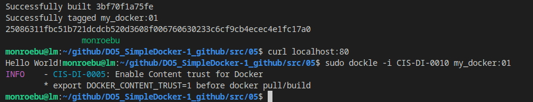<br>


## 6. Базовый **Docker Compose**

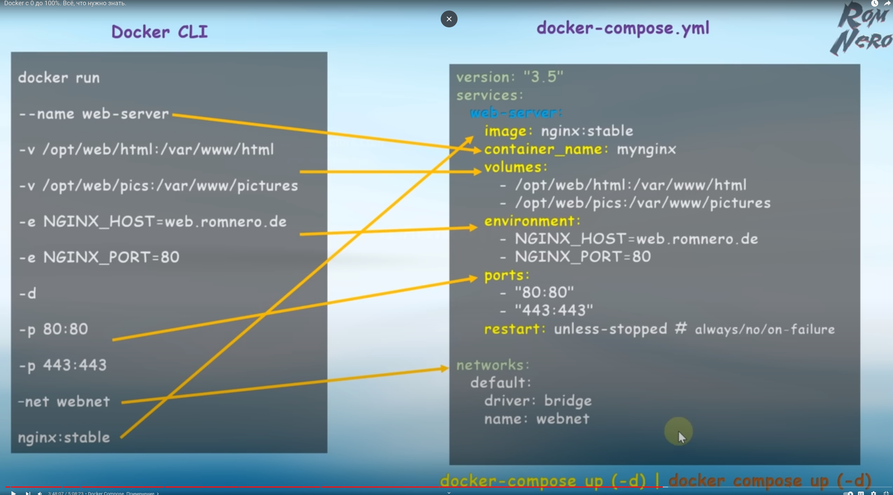<br>

1. Написать файл *docker-compose.yml*, с помощью которого:
    1) Поднять докер контейнер из [Части 5](#part-5-инструмент-dockle) _(он должен работать в локальной сети, т.е. не нужно использовать инструкцию **EXPOSE** и мапить порты на локальную машину)_
    2) Поднять докер контейнер с **nginx**, который будет проксировать все запросы с 8080 порта на 81 порт первого контейнера

* `sudo apt-get install docker-compose-plugin`

* В папке 06 создала директорию nginx (содержит файлы, необходимые для поднятия контейнера на основе образа nginx). 

* Контейнер докера из 5 части берем без изменений в папке 05 (указываем на неё ссылку в docker-compose.yml).

2. Замапить 8080 порт второго контейнера на 80 порт локальной машины

* В docker-compose.yml строчка 
```
  nginx:
    image: nginx
    ports:
      - 80:8080
```

* В файле nginx.conf второго контейнера
```
    server {
        listen 8080;

        location /proxy {
            stub_status on;
        }

        location / {
            proxy_pass http://server:81;
        }
    }
```

* Дать права на запуск всех созданных файлов

3. Остановить все запущенные контейнеры

4. Собрать и запустить проект с помощью команд `docker-compose build` и `docker-compose up`

* обновила докер sudo `snap refresh docker --channel=latest/edge`

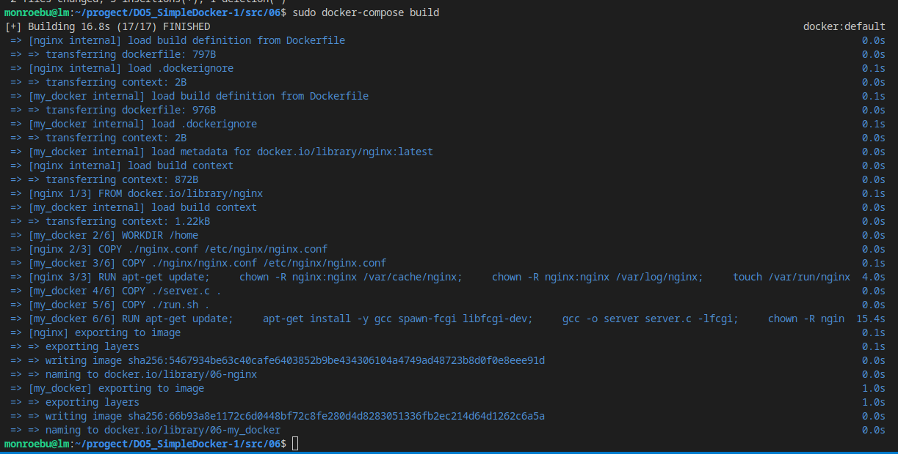<br>

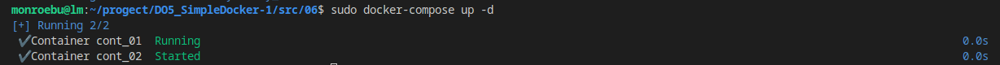<br>

5. Проверить, что в браузере по *localhost:80* отдается написанная вами страничка, как и ранее

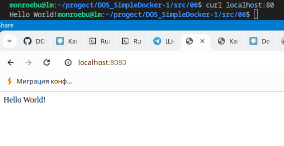<br>

* `sudo docker compose logs -f` - посмотреть логи

* `sudo docker compose stop` - остановить